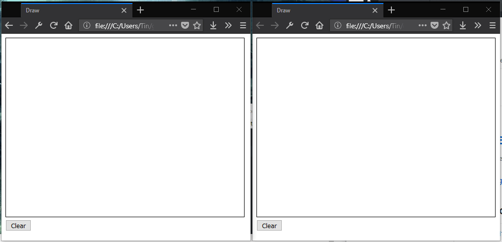

# simple-drawing-backend

此项目使用 GO 语言编写了一个简单白板（涂鸦）服务端功能。 所使用的通信协议是 WebSocket，因此所有的用户都将实时看到彼此的绘制路径。其次，用户还可以为画笔设置颜色等。

> [点此查看《使用golang构建实时白板》](https://my.oschina.net/997155658/blog/1606346)

### Install dependeice

```
$ glide install
```

### Running

Buld and run the server.

```
$ go build -o server && ./server
```

Open client/index.html in your browser.

### Snapshot


